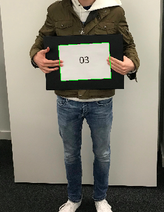

# Face Recognition and OCR
This courswork for INM460 Computer Vision at City, Universiy of London received the 2nd highest mark amongst 53 submissions. The aim was to create a dataset of faces and to create two functions: RecogniseFace and DetectNum.

## Dataset
For privacy reason the created dataset is not included in this repository. It contains however the notebook used to create the dataset: `FaceDetectionDatasetCreation.ipynb`

## RecogniseFace
The RecogniseFace function takes an image, feature type and classifier as input arguments and returns the position of all faces in an image together with their identity. Five face classification models were implemented:
* CNN: ResNet34 (achieving 98.40 % accuracy on the test-set)
* SVM with SURF features
* SVM with SIFT features
* Logistic Regression (LR) with SURF features
* Logistic Regression (LR) with SIFT features

The complete face detection and recognition pipeline is shown below.

It uses the following libraries:
* [DLib](http://dlib.net) C++ library for face detection  via HOG+MMOD
* [scikit-learn](http://scikit-learn.org/stable/index.html) for face recognition (classification) with SURF and SIFT features represented as bag-of-visual features with SVM as a classifier
* [PyTorch](https://pytorch.org) for face recognition. A pre-trained ResNet34 model is used as a fixed feature extractor.

The RecogniseFace function applied to one of the class images:

## DetectNum
DetectNum takes an image as input and automatically labels it by recognizing the number written on a white A4 paper that is held by the person we like to label. It uses [OpenCV](http://opencv.org) to detect the rectangle and [pytesseract](https://pypi.org/project/pytesseract/) for OCR.

## Notes  
More details can be found in the accompanying [coursework report](Report.pdf) and the [coursework requirements](CourseworkRequirements.pdf).  

Most state-of-the art face recognition models use some form of face embeddings trained by a deep convolutional neural network instead of using the complete image as an input in traditional CNN image classification (see for example the [Google FaceNet Paper](https://www.cv-foundation.org/openaccess/content_cvpr_2015/app/1A_089.pdf)).
A variant of such a model that is pre-trained on a massive face-dataset of around 3 million faces is available in the [Dlib library](http://blog.dlib.net/2017/02/high-quality-face-recognition-with-deep.html). It use facial landmarks to align faces to a standard pose in combination with face embeddings generated by a modified ResNet34.
